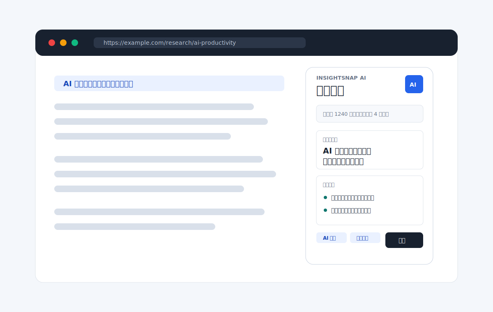
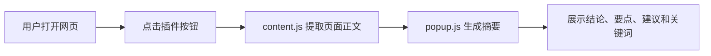

# InsightSnap AI

一个可直接加载使用的 AI 网页总结浏览器插件。它会读取当前网页正文，生成一句话结论、重点摘要、行动建议和关键词，适合用来展示“网页内容快速理解”的产品概念，也可以作为真实 AI 摘要插件的起点。



## 项目亮点

- 一键总结当前网页正文，减少长文阅读成本
- 输出结构清晰：一句话结论、重点摘要、行动建议、关键词
- 轻量 Chrome / Edge 插件形态，适合产品原型、作品集和面试展示
- 默认使用本地启发式摘要逻辑，打开即可使用
- 自动补注入内容脚本，刷新页面前后都能稳定读取
- 对浏览器内部页面、正文过短页面给出清晰提示
- 预留 AI 接入位置，后续可替换为 OpenAI、通义、智谱、DeepSeek 等模型 API

## 效果预览

插件弹窗采用左右分区的信息层级：

- 顶部显示当前页面状态和主操作按钮
- 中间展示 AI 总结结果
- 底部展示关键词、阅读时间和复制操作

展示图位于 [assets/showcase.svg](./assets/showcase.svg)，可直接在 GitHub README 中渲染。

## 快速开始

1. 下载或克隆本仓库。
2. 打开 Chrome 或 Edge，进入扩展管理页面。
   - Chrome: `chrome://extensions/`
   - Edge: `edge://extensions/`
3. 开启“开发者模式”。
4. 点击“加载已解压的扩展程序”。
5. 选择本项目根目录。
6. 打开任意文章页面，点击浏览器工具栏中的 InsightSnap AI 图标。

## 项目结构

```text
.
├── README.md
├── manifest.json
├── popup.html
├── popup.css
├── popup.js
├── content.js
└── assets
    └── showcase.svg
```

## 工作流程



## 功能说明

| 功能 | 状态 | 说明 |
| --- | --- | --- |
| 页面正文提取 | 已完成 | 从标题、描述、正文段落中提取内容，并过滤导航、页脚、表单等噪音 |
| 本地摘要演示 | 已完成 | 使用启发式算法模拟 AI 摘要效果 |
| 关键词提取 | 已完成 | 从页面文本中提取高频词 |
| 复制总结 | 已完成 | 一键复制当前摘要 |
| 失败重试 | 已完成 | 内容脚本未注入时自动补注入，并提供重试按钮 |
| 外部 AI API | 预留 | 可在 `popup.js` 中替换摘要函数 |

## 接入真实 AI API

当前 Demo 为了方便展示，默认不依赖网络服务。若要接入真实模型，可以在 [popup.js](./popup.js) 中替换 `createSummary` 函数：

```js
async function createSummary(page) {
  const response = await fetch("https://your-ai-endpoint.example.com/summarize", {
    method: "POST",
    headers: {
      "Content-Type": "application/json",
      Authorization: "Bearer YOUR_API_KEY"
    },
    body: JSON.stringify({
      title: page.title,
      url: page.url,
      text: page.text
    })
  });

  return response.json();
}
```

建议把 API Key 放在后端服务中，不要直接写入浏览器插件前端代码。

## 适用场景

- 产品原型展示
- AI 工具作品集
- 浏览器插件开发学习
- 网页阅读助手 Demo
- 面试或课程项目演示

## 后续计划

- 支持用户选择摘要长度
- 支持中英文自动识别
- 支持保存历史总结
- 支持导出 Markdown
- 支持真实 AI 模型配置页

## 许可

MIT License
